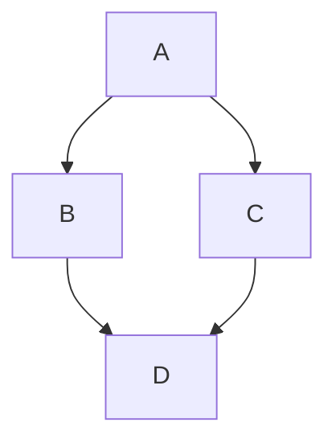

# Conjuntos
Os conjuntos podem ser entendidos como um agrupamento de itens semelhantes, separados de acordo com uma, ou mais caracteristicas.

## Proposição ou Sentença

Chama-se proposição ou sentença toda oração declarativa que pode ser clas
sificada em verdadeira ou em falsa.
Observamos que toda proposição apresenta três características obrigatórias:

   -1ª) sendo oração, tem sujeito e predicado;
   -2ª) é declarativa (não é exclamativa nem interrogativa);
   -3ª) tem um, e somente um, dos dois valores lógicos: ou é verdadeira (V) ou é 
falsa (F)

:

----
> [!WARNING]
> O conteúdo adiante é meramente ilustrativo das capacidades de renderização do GitHub.

ccc

$$ \[ \boxed{c_i = \sum_j A_{ij}} \] $$

$$ \\{ x \in R | x^2 \\} $$

$$x = {-b \pm \sqrt{b^2-4ac} \over 2a}$$

$$
\begin{equation}
   E = mc^2
\end{equation}$$

$$\begin{equation}
   e^{\pi i} + 1 = 0
\end{equation}$$

$$
\begin{equation}
  \int_0^\infty \frac{x^3}{e^x-1}\,dx = \frac{\pi^4}{15}
\end{equation}$$

$$
\begin{equation}
a=b+c
\end{equation} $$ 

$$
\begin{array}{cc}
   a & b \\
   c & d
\end{array}$$


**The Cauchy-Schwarz Inequality**\
$$\left( \sum_{k=1}^n a_k b_k \right)^2 \leq \left( \sum_{k=1}^n a_k^2 \right) \left( \sum_{k=1}^n b_k^2 \right)$$


> [!NOTE]
> Useful information that users should know, even when skimming content.

> [!TIP]
> Helpful advice for doing things better or more easily.

> [!IMPORTANT]
> Key information users need to know to achieve their goal.

> [!WARNING]
> Urgent info that needs immediate user attention to avoid problems.

> [!CAUTION]
> Advises about risks or negative outcomes of certain actions.
>





```geojson
{
  "type": "FeatureCollection",
  "features": [
    {
      "type": "Feature",
      "id": 1,
      "properties": {
        "ID": 0
      },
      "geometry": {
        "type": "Polygon",
        "coordinates": [
          [
              [-90,35],
              [-90,30],
              [-85,30],
              [-85,35],
              [-90,35]
          ]
        ]
      }
    }
  ]
}
```


```stl
solid cube_corner
  facet normal 0.0 -1.0 0.0
    outer loop
      vertex 0.0 0.0 0.0
      vertex 1.0 0.0 0.0
      vertex 0.0 0.0 1.0
    endloop
  endfacet
  facet normal 0.0 0.0 -1.0
    outer loop
      vertex 0.0 0.0 0.0
      vertex 0.0 1.0 0.0
      vertex 1.0 0.0 0.0
    endloop
  endfacet
  facet normal -1.0 0.0 0.0
    outer loop
      vertex 0.0 0.0 0.0
      vertex 0.0 0.0 1.0
      vertex 0.0 1.0 0.0
    endloop
  endfacet
  facet normal 0.577 0.577 0.577
    outer loop
      vertex 1.0 0.0 0.0
      vertex 0.0 1.0 0.0
      vertex 0.0 0.0 1.0
    endloop
  endfacet
endsolid
```

